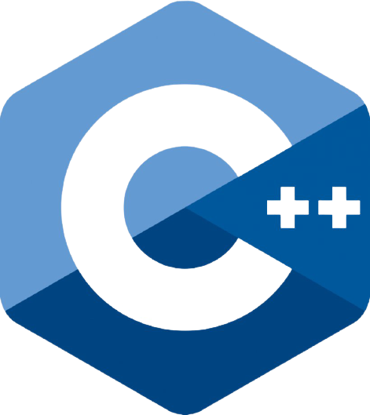
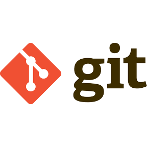

### Hi, I'm Aniket - [Aniket Chandrakant Dhole][website] 👋

#### I'm Developer, Self-Learner, Student.
<!-- **aniket1004/aniket1004** is a ✨ _special_ ✨ repository because its `README.md` (this file) appears on your GitHub profile. -->

- 🔭 I’m currently working on PHP api.
- 🌱 I’m currently learning building the api.
- 💬 Ask me about programming.
- 📫 How to reach me https://aniketdhole.netlify.app
### Connect with me:

[][website]
[][linkedin]
[][instagram]
[][twitter]

 

[website]: https://aniketdhole.netlify.app
[instagram]: https://instagram.com/aniket_dhole_
[linkedin]: https://www.linkedin.com/in/aniket-dhole-6932991a5
[twitter]: https://twitter.com/imaniketd?s=08

### Languages and tools

 
 
 

